# **EquiShield: AI-Powered Gender Bias Detection & Correction**  
---

## **Overview**  
**EquiShield** is an advanced **Gender Bias Detection & Correction System** that identifies implicit biases in news headlines and rewrites them with **neutral, unbiased alternatives** using **machine learning, NLP, and AI-based text generation**.  

🔹 **Bias Detection Model:** ML-based classification with TF-IDF feature extraction  
🔹 **Bias Correction:** Rule-based conditioning + AI-powered text rewriting (GPT-3/Hugging Face)  
🔹 **Interactive UI:** User-friendly **Streamlit-based web application**  

---

## **Key Features**  
- **Automated Bias Detection:** Identifies gender-biased language in news headlines  
- **Contextual Analysis:** Highlights **key words** contributing to bias  
- **Bias-Free Content Generation:** Suggests **AI-generated neutral versions** of biased text  
- **Customizable Rule-Based Filtering:** Ensures **real-time bias correction**  
- **User-Friendly Web Interface:** Built using **Streamlit** for interactive analysis  

---

## **Technology Stack**  
| **Category**          | **Tools & Technologies** |
|----------------------|------------------------|
| **Programming Language** | Python 🐍 |
| **Machine Learning** | Scikit-Learn, Naïve Bayes |
| **Natural Language Processing** | NLTK, SpaCy, TF-IDF, Word Embeddings |
| **AI Text Generation** | OpenAI GPT-3 / Hugging Face Transformers |
| **Web Framework** | Streamlit |
| **Deployment** | GitHub, Streamlit Cloud |

---

## **Installation & Setup**  

### **Clone the Repository**  
```bash
git clone https://github.com/Rajendran2201/equishield.git
cd equishield
```

### **Set Up a Virtual Environment & Install Dependencies**  
```bash
python -m venv venv
source venv/bin/activate  # On Windows use `venv\Scripts\activate`
pip install -r requirements.txt
```

### **Run the Web Application**  
```bash
streamlit run equishield.py
```
Once executed, the **EquiShield interface** will launch in your web browser.  

---

## Architecture 

```mermaid
flowchart LR

    %% ========= NODES ========= %%
    subgraph CLIENT["Client / UI"]
        UI["Streamlit Web App"]
    end

    subgraph INGEST["Ingestion"]
        IN["Input Text / Headline"]
    end

    subgraph PRE["Preprocessing & Features"]
        CLEAN["Text Cleaning"]
        TFIDF["TF-IDF Vectorizer"]
    end

    subgraph MODELS["Bias Detection Models"]
        NB["Naïve Bayes Model"]
        ML["ML Classifier"]
        ENS["Ensemble Logic"]
    end

    subgraph CORR["Explanation & Correction"]
        EXP["Bias Highlighting"]
        RULES["Rule-based Filters"]
        GENAI["AI Rewriter (GPT/HF)"]
    end

    subgraph OUT["Output & Integrations"]
        OUTTXT["Neutral / Rewritten Headline"]
        EXPORT["Export (CSV/JSON)"]
        DASH["Dashboard / Analytics"]
    end

    subgraph STORE["Storage"]
        ART["Model Files & Vectorizer"]
        LOGS["Logs & Metrics"]
    end

    subgraph OPS["Ops / Monitoring"]
        API["Optional REST API"]
        MON["Monitoring / CI"]
    end

    %% ========= FLOWS ========= %%
    UI --> IN
    IN --> CLEAN --> TFIDF
    TFIDF --> NB
    TFIDF --> ML
    NB --> ENS
    ML --> ENS
    ENS --> EXP --> RULES --> GENAI

    GENAI --> OUTTXT
    OUTTXT --> EXPORT
    OUTTXT --> DASH
    
    NB --> ART
    ML --> ART
    TFIDF --> ART

    UI --> LOGS
    ENS --> LOGS
    LOGS --> MON

    OUTTXT --> API

    %% ========= COLOR STYLES ========= %%
    classDef client fill:#E3F2FF,stroke:#66A8FF,color:#003A66;
    classDef ingest fill:#FFF4E5,stroke:#FFB74D,color:#663C00;
    classDef pre fill:#E6FFFA,stroke:#4DD0E1,color:#004D40;
    classDef models fill:#F3E5F5,stroke:#BA68C8,color:#4A148C;
    classDef corr fill:#FFF0F0,stroke:#EF9A9A,color:#7F0000;
    classDef out fill:#F1F8E9,stroke:#9CCC65,color:#33691E;
    classDef store fill:#EDE7F6,stroke:#9575CD,color:#311B92;
    classDef ops fill:#FFFDE7,stroke:#FFD54F,color:#5D4500;

    class UI client
    class IN client

    class IN ingest

    class CLEAN,TFIDF pre

    class NB,ML,ENS models

    class EXP,RULES,GENAI corr

    class OUTTXT,EXPORT,DASH out

    class ART,LOGS store

    class API,MON ops


```



## **Contributing**  
We welcome contributions from the **open-source community**!  

1. **Fork the repository**  
2. **Create a feature branch** (`git checkout -b feature-name`)  
3. **Commit your changes** (`git commit -m "commit-message"`)  
4. **Push to the branch** (`git push origin feature-name`)  
5. **Create a Pull Request**  
---

